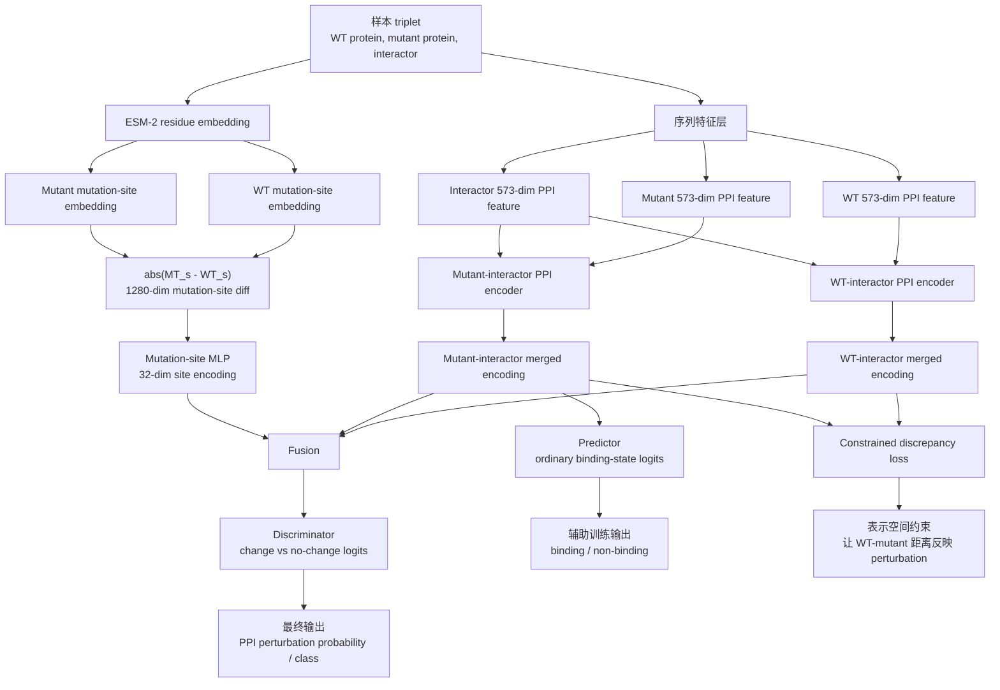

<!-- Generated locally by bin/export_paper_atlas.py. -->
<section class="paper-detail" id="paper-detail">
  <a class="paper-detail__back" href="{{ '/paper-atlas/' | relative_url }}">
    <i class="fa-solid fa-arrow-left" aria-hidden="true"></i> Back to Paper Atlas
  </a>
  <header class="paper-detail__hero">
    <div class="paper-detail__chips">
      <span>Protein &amp; Sequence Models</span>
      <span>Nature Methods · 2026</span>
    </div>
    <h1>eSIG-Net</h1>
    <p>eSIG-Net: an interaction language model that decodes the protein code of single mutations</p>
    <a class="paper-detail__doi" href="https://doi.org/10.1038/s41592-026-03086-x" target="_blank" rel="noopener noreferrer">Open paper <i class="fa-solid fa-arrow-up-right-from-square" aria-hidden="true"></i></a>
  </header>

  <div class="paper-detail__tabs" role="tablist" aria-label="Paper notes language">
    <button class="is-active" type="button" role="tab" id="paper-detail-tab-zh" aria-selected="true" aria-controls="paper-detail-panel-zh" data-detail-tab="zh">中文方法解读</button>
    <button type="button" role="tab" id="paper-detail-tab-en" aria-selected="false" aria-controls="paper-detail-panel-en" tabindex="-1" data-detail-tab="en">English Summary</button>
  </div>

<article class="paper-detail__panel" id="paper-detail-panel-zh" role="tabpanel" aria-labelledby="paper-detail-tab-zh" tabindex="0" data-detail-panel="zh" lang="zh-CN" markdown="1">

## eSIG-Net 方法中文解释

### 这篇论文要解决什么问题

eSIG-Net 解决的是一个很具体的问题：给定一个野生型蛋白、它的单点突变版本，以及一个相互作用蛋白，预测这个突变会不会改变原来的蛋白-蛋白相互作用状态。也就是说，它不是问“两个蛋白会不会相互作用”，而是问“这个突变是否会让原本的相互作用发生改变” [paper source/paper/hybrid_auto/paper.md:15-21, paper source/paper/hybrid_auto/paper.md:483-488]。

论文把这个问题称为类似化学机器学习里的 activity cliff：只改一个氨基酸，功能和相互作用可能发生很大变化。传统 PPI 模型通常只看一对蛋白，而不会显式建模 WT 和 mutant 之间的差异，所以容易错过这种 mutation-specific 的相互作用重连 [paper source/paper/hybrid_auto/paper.md:17-21]。

### 输入和输出

每个样本是一个 triplet：

```text
(WT protein, mutant protein, interactor)
```

输出是二分类：

```text
1 = 突变导致 WT-interactor 和 mutant-interactor 的相互作用状态不同
0 = 突变没有导致相互作用状态变化
```

论文使用两个主要数据集。疾病突变 PPI 数据集有 1,633 个样本，其中 606 个是 perturbed PPI，1,027 个是 nonperturbed PPI。population variant 数据集有 1,650 个变异、663 个 perturbed PPI、3,357 个 nonperturbed PPI，因此正样本比例大约只有 16% [paper source/paper/hybrid_auto/paper.md:489-493]。

### 方法的核心思想

eSIG-Net 的核心不是简单把 ESM embedding 接到分类器上，而是同时学习三类信息：

1. WT 和 interactor 的 PPI 表征；
2. mutant 和 interactor 的 PPI 表征；
3. WT 和 mutant 在突变位点上的 ESM-2 embedding 差异。

最后模型把这三类表征拼起来，用 discriminator 判断突变是否导致 PPI perturbation [paper source/paper/hybrid_auto/paper.md:21-21, paper source/paper/hybrid_auto/paper.md:530-536]。下面先给完整 framework，再在后面逐层解释每个模块。

### 完整 framework：从输入数据到输出结果

eSIG-Net 的 framework 可以分成 8 层：数据层、序列特征层、WT/mutant-interactor 编码层、mutation-site ESM 编码层、融合层、训练目标层、推理输出层、外部验证层。最重要的是区分两条主线：一条主线学习“这个 protein pair 是否 binding”，另一条主线学习“WT 到 mutant 是否改变了 binding state”。

#### 1. 总体流程图



这个图对应论文 Fig. 1a 和 Extended Data Fig. 1a 的逻辑：WT/mutant-interactor merged encodings、mutation-site ESM encoding 和 discriminator 是主干；predictor 和 constrained discrepancy 是训练时帮助模型学好表征的辅助结构 [paper source/paper/hybrid_auto/paper.md:227-228, paper source/paper/hybrid_auto/paper.md:850-852]。

#### 2. 每一层的输入、计算和输出

| 层 | 输入 | 计算 | 输出 | 本地代码状态 |
|---|---|---|---|---|
| 数据层 | WT、mutant、interactor、前后 binding labels、mutation index | 组织成 triplet 和 fold CSV | 一个 mutation-interactor 样本 | `Exact`：`SDNNPPIdataset` 返回原始/突变特征、label、mutation id、ESM diff [eSIG-Net_repo/ppi_dataset.py:29-51] |
| 573 维序列特征层 | protein sequence | AAC 20 + conjoint triad 343 + auto covariance 210 | 每个蛋白一个 573 维向量 | `Partial`：论文定义了特征，代码只读取预计算 HDF5 [paper source/paper/hybrid_auto/paper.md:495-504, eSIG-Net_repo/ppi_dataset.py:81-106] |
| WT-interactor 编码 | WT 573 维、interactor 573 维 | 两个通道 MLP + merge layer | WT-interactor merged encoding | `Exact`：`SdnnModel.forward` 生成 merged encoding [eSIG-Net_repo/backbones/sdnn/sdnn_model.py:43-147] |
| mutant-interactor 编码 | mutant 573 维、interactor 573 维 | 同构 PPI encoder + merge layer | mutant-interactor merged encoding | `Exact`：训练中对 `n0_2,n1_2` 再跑一次 model [eSIG-Net_repo/ppi_learner.py:415-424] |
| mutation-site ESM 编码 | WT 和 mutant 在突变位点的 ESM-2 layer 33 embedding | 取绝对差，再过 MLP | 32 维 mutation-site encoding | `Exact`：`__get_esm_diff` + `esm_model` [eSIG-Net_repo/ppi_dataset.py:117-130, eSIG-Net_repo/backbones/sdnn/sdnn_model.py:117-123] |
| 融合和判别层 | WT merged、mutant merged、site encoding | concat 后送入 discriminator | change/no-change logits | `Exact`：`discriminator_esm` 拼接三路输入 [eSIG-Net_repo/backbones/sdnn/sdnn_model.py:155-161] |
| 训练目标层 | discriminator logits、predictor logits、merged encoding distances | CE loss + pair/discrepancy loss | 总 loss | `Partial`：三类损失存在，但权重和 Eq. 1 形式与论文不完全一致 [eSIG-Net_repo/ppi_learner.py:430-438, eSIG-Net_repo/ppi_learner.py:462-481] |
| 评估输出层 | discriminator logits | change class probability / prediction | perturbation prediction 和 AUPR 等指标 | `Partial`：本地代码有 AUPR，没有找到 ROC-AUC 计算 [eSIG-Net_repo/ppi_learner.py:487-604] |

#### 3. 训练 framework

训练阶段不是只训练一个二分类器，而是同时优化三个信号：

```text
主任务:
    discriminator(WT-interactor, mutant-interactor, mutation-site encoding)
    -> 预测 PPI 是否被突变改变

辅助任务 1:
    predictor(pair merged encoding)
    -> 预测普通 binding / non-binding 状态

辅助任务 2:
    constrained discrepancy / pair loss
    -> 约束 WT-interactor 和 mutant-interactor 的表示距离
```

##### 辅助任务 1 详细解释：predictor 到底在帮什么忙

这里的 predictor 不是最终回答“mutation 是否 perturb PPI”的输出头；它是一个辅助监督头，逼迫 PPI encoder 学到“某个 protein-interactor pair 本身是否 binding”的基本语义。换句话说，discriminator 学的是 **before/after 是否变化**，predictor 学的是 **单个 pair 是否相互作用**。这两个问题相关但不相同：

```text
predictor:
    输入 = 一个 pair 的 merged encoding
    目标 = 这个 pair 是 binding 还是 non-binding
    作用 = 让 merged encoding 保留普通 PPI 识别能力

discriminator:
    输入 = WT-interactor merged encoding + mutant-interactor merged encoding + mutation-site encoding
    目标 = WT -> mutant 后 binding state 是否改变
    作用 = 输出最终 PPI perturbation prediction
```

为什么需要这个辅助任务？如果只训练 discriminator，模型可以只追求“change / no-change”分类，而不一定学到每个 pair 的 binding 语义。加入 predictor 后，merged encoding 同时要服务于普通 PPI prediction 和 mutation-induced change prediction。这样 constrained discrepancy 才有更好的基础：WT-interactor 和 mutant-interactor 的距离不是任意表征距离，而是在一个能区分 binding state 的空间里比较距离。

论文的总目标里，`L_pred` 就是这个 predictor loss。论文写 discriminator loss 和 predictor loss 都是 cross-entropy：discriminator 的 label 是 perturbation/no-change，predictor 的 label 是 interaction/binding state，即 `1 = binding`、`0 = non-binding` [paper source/paper/hybrid_auto/paper.md:530-536]。

本地代码里的 predictor 定义在 `SdnnModel.prediction_module`：它接收 32 维 `merged_out`，经过若干 Linear/ReLU/Self_Attention 层，最后输出 2 维 logits [eSIG-Net_repo/backbones/sdnn/sdnn_model.py:103-147]。训练时，代码先计算第一路 pair 的 `pred, merged_out = model(n0, n1)`，再用 `CrossEntropyLoss(pred, y)` 得到 `bce_loss` / `accuracy_loss` [eSIG-Net_repo/ppi_learner.py:415-438]。

需要注意 paper-vs-code 的一个边界：论文图和 Extended Data Fig. 1a caption 强调 MT-interactor merged encoding 进入 predictor [paper source/paper/hybrid_auto/paper.md:850-852]；但本地代码中，直接进入 CE loss 的是第一路 `pred` 和 `y`，而第二路 `pred_2 = model(n0_2,n1_2)` 的 predictor logits 没有单独进入 CE loss，主要是它的 `merged_out_2` 被送入 discriminator 和 pair loss [eSIG-Net_repo/ppi_learner.py:415-438]。因此这里应理解为：**predictor 是普通 binding-state 辅助监督头；在论文框架中它服务于 pair-level PPI prediction，在本地代码实现中它主要用第一路 pair 的 label 训练，第二路 mutant pair 主要贡献表征给 perturbation 分支。**

一个具体例子可以这样理解：

```text
WT-interactor label y = 1       # WT 与 interactor binding
Mutant-interactor label y_2 = 0 # mutant 后不 binding

predictor 学:
    给定某个 pair merged encoding，判断这个 pair 是否 binding

discriminator 学:
    比较 WT-interactor 和 mutant-interactor，并结合 mutation-site ESM 差异，
    判断 y 和 y_2 是否不同，即是否发生 perturbation
```

所以 predictor 的价值不是直接输出最终结论，而是把 PPI encoder 训练成“知道 binding 是什么”的表示学习模块；最终是否 perturb 仍由 discriminator 结合 WT/mutant 差异来判断。

论文写成：

$$
\mathcal {L}
=
\mathcal {L}_{discrim}
+ \alpha_1 \mathcal {L}_{pred}
+ \alpha_2 \mathcal {L}_{cd}
$$

代码里的实际组合是：

```text
loss = accuracy_loss + pair_weight * pair_loss + discrim_weight * discrim_loss
```

这说明本地代码的 framework 和论文的三损失结构一致，但不是完全相同的数值配置。论文写 $\alpha_1=0.9$、$\alpha_2=0.1$、50 epochs、lr 0.005；本地配置是 `pair_weight=0.05`、`discrim_weight=1.0`、`n_epochs=8`、`lr_init=0.001` [paper source/paper/hybrid_auto/paper.md:540-546, eSIG-Net_repo/config_train.yaml:19-39]。

#### 4. 推理和评估 framework

推理时，真正用于 perturbation 判断的是 discriminator 分支。代码在 `ensemble_func == 'disc'` 时取 `pred_change` 的最大 logit 类别作为预测，并把 `softmax(pred_change)[:,1]` 用于 AUPR [eSIG-Net_repo/ppi_learner.py:522-604]。

因此可以把 inference 理解成：

```text
输入一个新 triplet
    -> 读取或生成 WT / mutant / interactor 的 573 维特征
    -> 读取 WT / mutant 在突变位点的 ESM embedding
    -> 得到 WT-interactor merged encoding
    -> 得到 mutant-interactor merged encoding
    -> 得到 mutation-site encoding
    -> discriminator 输出 no-change/change logits
    -> change 概率越高，越倾向于预测 mutation perturbs this PPI
```

论文还把模型输出用于两个层面的评估：第一是 benchmark 层面，比较 sequence-based 和 structure-based baselines；第二是 biological application 层面，用 TPM3、COQ8A、TCGA-MMRF 和 immunotherapy cohort 展示潜在机制解释 [paper source/paper/hybrid_auto/paper.md:230-250, paper source/paper/hybrid_auto/paper.md:592-594]。本地代码只覆盖核心训练/评估路径；structure baseline、TCGA/MMRF、immunotherapy 和 figure-generation 脚本在本地 snapshot 中 `Not found`。

#### 5. framework 里最容易误解的边界

- **不是普通 PPI prediction**：普通模型预测 `P(WT, interactor)` 或 `P(mutant, interactor)` 是否 binding；eSIG-Net 的核心输出是两者是否发生 state change。
- **ESM 不是整序列 pooling 主角**：主公式使用突变位点的 WT/MT ESM embedding 差值，而不是把整条序列 embedding 直接平均后分类 [paper source/paper/hybrid_auto/paper.md:518-528]。
- **constrained discrepancy 不是最终输出头**：它是训练约束，让 merged encoding 的距离更符合 perturbation 标签；最终 perturbation 预测来自 discriminator。
- **paper 图里的 shared weights 与本地代码不完全一致**：Extended Data Fig. 1a 说 MT/WT encoders share weights，但本地 `SdnnModel` 是两个独立 `channel_1` / `channel_2` [paper source/paper/hybrid_auto/paper.md:850-850, eSIG-Net_repo/backbones/sdnn/sdnn_model.py:43-101]。
- **完整实验 framework 大于本地代码 framework**：论文包含结构基线、癌症队列和免疫治疗响应分析；本地代码 snapshot 主要是模型训练/评估，不包含这些下游验证脚本。

一个更简化的流程是：

```text
WT sequence      interactor sequence
       \          /
        PPI encoder -> WT-interactor merged encoding

Mutant sequence  interactor sequence
       \          /
        PPI encoder -> mutant-interactor merged encoding

WT ESM at mutation site
Mutant ESM at mutation site
        -> absolute difference -> mutation-site encoding

[WT-interactor encoding, mutant-interactor encoding, mutation-site encoding]
        -> discriminator -> mutation perturbs PPI or not
```

### 573 维 PPI 输入特征

论文先把蛋白序列转换为固定长度向量，因为原始序列长度不同，不能直接输入普通 MLP。它使用三组特征：

| 特征 | 维度 | 含义 |
|---|---:|---|
| amino acid composition | 20 | 每种氨基酸出现频率 |
| conjoint triad | 343 | 7 类氨基酸 cluster 的三联体组合 |
| auto covariance | 210 | 不同间隔位置上理化性质的协方差 |

三者拼接后得到 573 维向量 [paper source/paper/hybrid_auto/paper.md:495-504]。

本地代码没有从 FASTA/原始序列重新生成这些 573 维特征，而是直接从 HDF5 读取预计算好的 `id_A`、`id_B`、`id_A_2` 特征 [eSIG-Net_repo/ppi_dataset.py:81-106]。所以这个 workspace 里的代码可以说明模型如何使用这些特征，但不能完整复现实验前处理。

### 突变位点 ESM-2 编码

论文的 mutation-site encoding 用的是 ESM-2 residue-level embedding。只取突变位置 `s` 的 embedding，而不是对整条序列 pooling。公式是：

$$
f(\mathrm{MT}, \mathrm{WT})
= \operatorname{MLP}
\left(
\left|
\operatorname{esm}(\mathrm{MT})_s
-
\operatorname{esm}(\mathrm{WT})_s
\right|
\right)
$$

这里 `esm(MT)_s` 和 `esm(WT)_s` 分别是突变体和野生型在突变位点的 ESM-2 向量 [paper source/paper/hybrid_auto/paper.md:518-528]。

代码里 `ppi_dataset.py` 会读取 `['representations'][33]`，取 `mute_id` 对应位置，然后计算绝对差值 `torch.abs(id_A_muta_feat - id_A_2_muta_feat)` [eSIG-Net_repo/ppi_dataset.py:117-130]。模型里的 `esm_model` 再把 1280 维差值映射到 32 维 [eSIG-Net_repo/backbones/sdnn/sdnn_model.py:117-123]。

这一部分是 paper 和代码匹配度最高的模块之一。

### constrained discrepancy learning 是什么

论文希望模型不仅预测分类标签，还要让表征空间里的 WT-mutant 距离反映相互作用是否真的改变。设：

- $d_i$ 是第 $i$ 个样本里 WT-interactor 和 mutant-interactor merged encoding 的距离；
- $c_i=1$ 表示该样本发生 PPI perturbation，$c_i=0$ 表示没有变化。

论文给出的 constrained discrepancy loss 是：

$$
\mathcal {L}_{cd} =
\frac{1}{n(n-1)}
\sum_i
\sum_{j \ne i}
\left(
\frac{d_i}{1+\lambda c_i}
-
\frac{d_j}{1+\lambda c_j}
\right)^2
$$

它的直觉是：如果突变改变了相互作用，WT 和 mutant 的 merged encoding 应该和未改变的情况不同；但这个损失不能单独使用，否则所有距离都变成 0 也是一个 trivial solution，所以要和预测损失联合训练 [paper source/paper/hybrid_auto/paper.md:506-516]。

本地代码实现的是同一思想的一个近似版本。`__sdnn_pair_loss` 对 WT/mutant merged encoding 计算 L2 距离，根据前后 label 是否相同选择 `edit_dist=1` 或 `max_edit_dist`，再用 `EditLoss` 对归一化距离做 all-pairs MSE [eSIG-Net_repo/ppi_learner.py:462-481, eSIG-Net_repo/losses.py:4-18]。这和论文 Eq. 1 的形式不完全一致，因此应标为 `Partial`，不是 `Exact`。

### 总损失函数

论文写的总目标是：

$$
\mathcal {L}
=
\mathcal {L}_{discrim}
+ \alpha_1 \mathcal {L}_{pred}
+ \alpha_2 \mathcal {L}_{cd}
$$

其中：

- `L_discrim`：判断突变是否改变 PPI；
- `L_pred`：普通 interaction/binding state 预测；
- `L_cd`：constrained discrepancy loss [paper source/paper/hybrid_auto/paper.md:530-536]。

代码中的实际写法是：

```text
loss = accuracy_loss + pair_weight * pair_loss + discrim_weight * discrim_loss
```

其中 `accuracy_loss` 是 predictor 的交叉熵，`pair_loss` 是距离约束，`discrim_loss` 是 perturbation/no-change 的交叉熵 [eSIG-Net_repo/ppi_learner.py:430-438]。

注意一个重要差异：论文写训练使用 lr 0.005、50 epochs、$\alpha_1=0.9$、$\alpha_2=0.1$ [paper source/paper/hybrid_auto/paper.md:540-546]；本地 `config_train.yaml` 里是 `lr_init: 0.001`、`n_epochs: 8`、`pair_weight: 0.05`、`discrim_weight: 1.0` [eSIG-Net_repo/config_train.yaml:19-39]。所以本地代码能解释核心方法，但不能直接等同于论文最终实验配置。

### 模型结构和代码对应

`SdnnModel` 里有两个输入通道：

- `channel_1`：处理第一个蛋白特征；
- `channel_2`：处理第二个蛋白特征；
- `merged`：把两个通道拼接后的结果映射为 32 维；
- `prediction_module`：做普通 PPI/binding prediction；
- `esm_model`：把 1280 维 mutation-site ESM 差异映射为 32 维；
- `discriminator_esm`：拼接 WT-interactor encoding、mutant-interactor encoding、ESM mutation encoding，输出 perturbation logits [eSIG-Net_repo/backbones/sdnn/sdnn_model.py:43-161]。

Extended Data Fig. 1a 的 caption 说 MT/WT encoders share weights [paper source/paper/hybrid_auto/paper.md:850-850]。但代码中 `channel_1` 和 `channel_2` 是两个独立的 `nn.Sequential`，没有共享同一个 module object [eSIG-Net_repo/backbones/sdnn/sdnn_model.py:43-101]。这是一个明确的 paper-code 差异。

### 训练和验证

论文声称使用严格五折交叉验证：每次一个 fold 作 test，其余 fold 再分 train/validation，超参数只在 validation 上选择，最终性能在 test fold 上报告 [paper source/paper/hybrid_auto/paper.md:538-550]。

代码支持五折训练：

- `config_train.yaml` 设置 `k_fold: 5` [eSIG-Net_repo/config_train.yaml:10-13]；
- `main.py` 在 `k_fold` 打开时循环训练每个 fold [eSIG-Net_repo/main.py:116-124]；
- `ppi_dataset.py` 根据 fold id 读取训练 fold 或 held-out fold [eSIG-Net_repo/ppi_dataset.py:53-70]；
- `ppi_learner.py` 以 validation accuracy 选择最佳 checkpoint [eSIG-Net_repo/ppi_learner.py:199-233]。

但代码里在 validation accuracy 刷新时也会立即计算 test metrics [eSIG-Net_repo/ppi_learner.py:217-230]。这不一定改变 checkpoint 选择，因为选择标准仍是 validation accuracy，但和论文“test fold unseen until final evaluation”的表述不完全一致。

### 结果如何理解

论文报告 eSIG-Net 在 disease mutation PPI 数据集上 accuracy 0.85 +/- 0.02、ROC-AUC 0.91 +/- 0.02、average precision 0.86 +/- 0.01，优于 SDNN、D-SCRIPT、DeepFE、PIPR、PLM-interact [paper source/paper/hybrid_auto/paper.md:230-232]。在 population variant 数据集上也有类似相对优势 [paper source/paper/hybrid_auto/paper.md:232-234]。

Ablation 结果说明两个新增模块都有贡献：standard ESM pooling 较弱，加入 mutation-site encoding 有提升，再加入 constrained discrepancy 后最好 [paper source/paper/hybrid_auto/paper.md:234-236]。

结构方法对比部分说明，AlphaFold/FoldDock 和 MutaBind2、BeAtMuSiC、GeoPPI、TopNetTree、PIONEER 等结构方法在这个 mutation-mediated PPI 任务上表现更低 [paper source/paper/hybrid_auto/paper.md:236-236]。Extended Data Table 1 还显示 WT 和 mutant 的 AlphaFold-Multimer 全局结构非常相似，平均 TM-score 0.84、global RMSD 0.92 A，这解释了为什么只看全局结构可能不够 [paper source/paper/hybrid_auto/paper.md:931-935]。

### 本地代码能复现什么

可以复现或研究：

- SDNN 风格的 PPI feature 输入；
- ESM-2 mutation-site 差异输入；
- WT/mutant-interactor 双前向路径；
- discriminator/predictor/pair loss 的组合；
- 五折训练和评估框架 [eSIG-Net_repo/main.py:116-124, eSIG-Net_repo/ppi_learner.py:146-233]。

不能直接完整复现：

- 573 维特征从原始序列的生成；
- 大型 HDF5/ESM embedding 数据；
- ROC-AUC 计算脚本；
- FoldDock、MutaBind2、BeAtMuSiC、GeoPPI、TopNetTree、PIONEER 等结构基线流程；
- TCGA/MMRF、immunotherapy response、图表生成脚本。

这些缺口在本 workspace 中应保持 `Not found`，不能写成代码已实现。

### 一句话总结

eSIG-Net 的方法价值在于把“突变是否改变某个具体 PPI”建模为一个显式的 WT-vs-mutant interaction difference learning 问题。它用 573 维序列特征表示 PPI，用 ESM-2 突变位点差异表示 mutation effect，再用 constrained discrepancy 和 discriminator 学习 interaction perturbation。当前本地代码实现了核心神经网络和训练框架，但不是论文全部实验和全部超参数的完整复现包。

</article>
<article class="paper-detail__panel" id="paper-detail-panel-en" role="tabpanel" aria-labelledby="paper-detail-tab-en" tabindex="0" data-detail-panel="en" lang="en" markdown="1" hidden>

## eSIG-Net Summary

### What Problem It Solves

eSIG-Net targets a specific variant-effect problem: given a wild-type protein, a single-mutant version of that protein, and an interaction partner, predict whether the mutation changes the protein-protein interaction (PPI) state. The paper frames this as an "interaction cliff" problem: single missense variants can produce large and interaction-specific effects that ordinary sequence or structure models do not explicitly learn [paper source/paper/hybrid_auto/paper.md:15-21].

The input unit is a triplet, not an isolated protein or a single protein pair. The disease mutation dataset contains 1,633 triplets with 606 perturbed and 1,027 nonperturbed PPIs; the population-variant dataset contains 1,650 variants with 663 perturbed and 3,357 nonperturbed PPIs [paper source/paper/hybrid_auto/paper.md:489-493].

### Main Contribution

The paper introduces eSIG-Net, the edgetic mutation sequence-based interaction grammar network. Its key idea is to model the difference between the wild-type-interactor and mutant-interactor states directly, while also using ESM-2 residue embeddings at the mutation site. The method combines:

- sequence-derived PPI features for WT-interactor and mutant-interactor pairs;
- an ESM-2 mutation-site difference vector;
- a constrained discrepancy term that makes merged WT and mutant interaction embeddings respond to interaction-state changes;
- a discriminator that predicts whether the mutation perturbs the interaction [paper source/paper/hybrid_auto/paper.md:21-21, paper source/paper/hybrid_auto/paper.md:483-488].

### Method In One Pass

Each protein sequence is transformed into a fixed-length 573-dimensional feature vector by concatenating amino acid composition, conjoint triad, and auto covariance features. The paper also extracts the ESM-2 `esm2_t33_650M_UR50D` residue embedding at the mutation site, giving a 1,280-dimensional mutation-site feature [paper source/paper/hybrid_auto/paper.md:495-504].

The mutation-site module computes:

$$
f(\mathrm{MT}, \mathrm{WT}) = \operatorname{MLP}(|\operatorname{esm}(\mathrm{MT})_s - \operatorname{esm}(\mathrm{WT})_s|)
$$

The model then concatenates the mutant-interactor merged encoding, wild-type-interactor merged encoding, and mutation-site encoding, and feeds them to a discriminator [paper source/paper/hybrid_auto/paper.md:518-536].

The paper's constrained discrepancy loss compares scaled distances between WT and mutant merged encodings:

$$
\mathcal{L}_{cd} =
\frac{1}{n(n-1)}
\sum_i \sum_{j \ne i}
\left(
\frac{d_i}{1+\lambda c_i} -
\frac{d_j}{1+\lambda c_j}
\right)^2
$$

where $c_i=1$ marks a perturbed interaction and $d_i$ is the embedding-level WT-vs-mutant distance. The total paper objective is:

$$
\mathcal{L} = \mathcal{L}_{discrim} + \alpha_1 \mathcal{L}_{pred} + \alpha_2 \mathcal{L}_{cd}
$$

The paper states that discriminator and predictor losses are cross-entropy losses, and that hyperparameters were tuned within validation folds [paper source/paper/hybrid_auto/paper.md:506-538].

### Evaluation Claims

The paper benchmarks eSIG-Net against five sequence-based PPI methods: SDNN, D-SCRIPT, DeepFE, PIPR, and PLM-interact. On the disease mutation PPI dataset, it reports eSIG-Net accuracy of 0.85 +/- 0.02, ROC-AUC of 0.91 +/- 0.02, and average precision of 0.86 +/- 0.01, outperforming the listed sequence baselines [paper source/paper/hybrid_auto/paper.md:230-232]. On population variants, the paper reports similar relative performance [paper source/paper/hybrid_auto/paper.md:232-234].

The ablation study supports the two main method modules. Standard ESM pooling gives lower accuracy, mutation-site encoding improves it, and adding constrained discrepancy improves further to 0.85 +/- 0.02 on disease mutations and 0.90 +/- 0.01 on population variants [paper source/paper/hybrid_auto/paper.md:234-236].

For structure-based comparison, the paper evaluates AlphaFold/FoldDock and mutation-centric structure tools including MutaBind2, BeAtMuSiC, GeoPPI, TopNetTree, and PIONEER. It reports eSIG-Net ROC-AUC 0.91 +/- 0.02 and average precision 0.86 +/- 0.01, higher than the structure-based alternatives on the disease mutation benchmark [paper source/paper/hybrid_auto/paper.md:236-236].

The paper also applies the model to pleiotropic TPM3 mutations and COQ8A examples, and to TCGA-MMRF and immunotherapy-response contexts, but those application scripts were not found in the local code snapshot [paper source/paper/hybrid_auto/paper.md:238-250, paper source/paper/hybrid_auto/paper.md:592-594].

### Code Match

The local code implements the core model path. `SdnnModel` defines two 573-dimensional input channels, merges them to a 32-dimensional representation, maps the 1,280-dimensional ESM mutation-site difference to 32 dimensions, and uses `discriminator_esm` to combine WT-interactor, mutant-interactor, and ESM encodings [eSIG-Net_repo/backbones/sdnn/sdnn_model.py:43-161]. `SDNNPPIdataset` loads fold CSVs and HDF5 features, then computes an absolute ESM layer-33 mutation-site difference [eSIG-Net_repo/ppi_dataset.py:10-130].

The code implements a related but not literal version of the paper loss. Training uses predictor cross-entropy, discriminator cross-entropy, and a pair loss over normalized L2 distances [eSIG-Net_repo/ppi_learner.py:405-451, eSIG-Net_repo/ppi_learner.py:462-481]. `EditLoss` computes all-pairs MSE over the vector of normalized distances [eSIG-Net_repo/losses.py:4-18]. This matches the paper's constrained-discrepancy concept, but it is not the exact Eq. 1 formula.

Important code-paper differences:

- The paper says MT/WT encoders share weights in Extended Data Fig. 1a, but the code defines independent `channel_1` and `channel_2` modules [paper source/paper/hybrid_auto/paper.md:850-850, eSIG-Net_repo/backbones/sdnn/sdnn_model.py:43-101].
- The paper states Adam lr 0.005, 50 epochs, and loss weights $\alpha_1=0.9$, $\alpha_2=0.1$ [paper source/paper/hybrid_auto/paper.md:540-546]. The local config uses `lr_init: 0.001`, `n_epochs: 8`, `pair_weight: 0.05`, and `discrim_weight: 1.0` [eSIG-Net_repo/config_train.yaml:19-39].
- The paper's ROC-AUC and AUPR method is described in Methods [paper source/paper/hybrid_auto/paper.md:568-578]. The inspected local evaluation computes accuracy, precision, recall, F1, and AUPR from discriminator probabilities, but no ROC-AUC computation was found in the local source files [eSIG-Net_repo/ppi_learner.py:487-604].

### Reproducibility Status

Reproducibility rating: **2/5**.

What is present:

- Core PyTorch model, dataset loader, training loop, evaluation loop, config, CLI, and README usage instructions [eSIG-Net_repo/README.md:36-79, eSIG-Net_repo/README.md:93-177].
- Fivefold training logic and deterministic seeding in code [eSIG-Net_repo/main.py:116-124, eSIG-Net_repo/ppi_learner.py:146-233].
- Example evaluation result files and feature dumps in the local snapshot.

What is missing or partial:

- Raw feature-construction scripts for AAC, conjoint triad, and auto covariance were not found.
- Required large assets such as `datasets/embeddings/sdnn_corrected_ppi.h5`, `datasets/embeddings/650M_1`, and fold CSVs are not present in the local code snapshot.
- ROC-AUC, structure-baseline, TCGA/MMRF, immunotherapy-response, and figure-generation pipelines were not found.
- Code provenance is inconsistent: the paper and `.repo_source` point to `Stephen-Yi-Laboratory/eSIG-Net`, while the nested git checkout reports remote `aqlkzf/image_paperRead` and HEAD `a6746d9df2c4601690b563f45e8f99f9fe2fad85`.

Overall, the repository supports understanding and partially rerunning the central eSIG-Net architecture, but it does not provide a complete reproduction package for all paper experiments.

</article>
</section>

<script defer src="{{ '/assets/js/paper-atlas-detail.js' | relative_url | bust_file_cache }}"></script>
