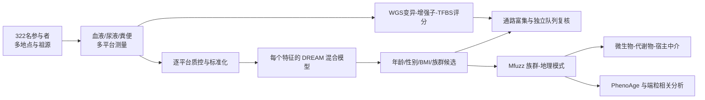

<!-- Generated locally by bin/export_paper_atlas.py. -->
<section class="paper-detail" id="paper-detail">
  <a class="paper-detail__back" href="{{ '/paper-atlas/' | relative_url }}">
    <i class="fa-solid fa-arrow-left" aria-hidden="true"></i> Back to Paper Atlas
  </a>
  <header class="paper-detail__hero">
    

      Atlases &amp; Resources
      Cell · 2026
    

    <h1>hPOP</h1>
    
A comparison of deep multiomics profiles across ethnicity, geography, and age

    <a class="paper-detail__doi" href="https://doi.org/10.1016/j.cell.2026.04.032" target="_blank" rel="noopener noreferrer">Open paper <i class="fa-solid fa-arrow-up-right-from-square" aria-hidden="true"></i></a>
  </header>

  

    <button class="is-active" type="button" role="tab" aria-selected="true" data-detail-tab="zh">中文方法解读</button>
    <button type="button" role="tab" aria-selected="false" data-detail-tab="en">English Summary</button>
  

<article class="paper-detail__panel" data-detail-panel="zh" lang="zh-CN" markdown="1">

## hPOP：跨族群、地理与年龄的深度多组学图谱如何读

### 一句话抓住这篇论文

hPOP 不是先提出一个新的预测模型，再用数据证明模型有效；它先在 322 名参与者、378 次采样中同时测量血液、尿液和粪便的多种分子层，然后用一组统计分析回答三个逐层深入的问题：哪些分子差异与年龄、性别、BMI 或族群相关；同一祖源的人生活在不同地区时，哪些差异会随环境改变；微生物、代谢物、宿主基因表达和生物年龄之间是否存在值得后续实验验证的中介链。

因此，阅读这项工作的正确顺序是：先看队列设计能支持什么比较，再看每个统计模块怎样缩小候选范围，最后再判断整合出的生物学链条有多强的证据。它是一张横断面人群图谱，不是因果实验。

### 1. 研究设计决定了能够回答的问题

论文在 2016—2019 年间于五个地点采样，包括美国、台湾和爱尔兰等 HUPO 会议地点。共获得 378 份样本，来自 322 名独立参与者。参与者被归入东亚祖源（EA）、欧洲祖源（EuAn）和南亚祖源（SA）等组，同时记录其居住地。这个设计最有价值的地方，是同一祖源内部也存在不同居住地区，例如生活在东亚或东亚以外地区的 EA，以及生活在欧洲或北美的 EuAn。

这让作者可以做两类不同的比较：

1. 族群间比较：例如 EuAn 相对 EA 的分子丰度差异。
2. 族群内地理比较：例如 EuAn 在欧洲与美国/加拿大的差异。

第二类比较能提示环境可塑性，但不能自动把差异归因于某个具体环境因素。饮食、旅行经历、社会经济状态、招募地点和未测量暴露仍可能混在一起。图 1 的环形队列图正是在说明祖源、性别、年龄和居住地并不均匀分布，所以后续模型必须控制协变量。

论文覆盖的测量层包括基因组、转录组、血浆蛋白组、靶向与非靶向代谢组、脂质组、糖组、金属组、代谢激素、病原体反应抗体、16S 微生物组和粪便宏蛋白组。不同平台并非每位参与者都有完整数据，因此每项分析的有效样本数不同；不能把“322 人”理解为每个特征都有 322 个完整观测。

### 2. 第一层分析：逐特征混合模型

#### 2.1 它在问什么

对每个组学平台中的每个分子特征，作者分别检验年龄、性别、BMI 和族群是否与其丰度相关。可以把核心模型简化写成：

$$
y = X_v\beta_v + Zu + \epsilon,
$$

其中 $y$ 是某一个分子特征在所有样本中的测量值，$v$ 是当前要检验的变量，$\beta_v$ 是它的效应；$Zu$ 吸收站点、参与者重复测量及其他协变量带来的变异，$\epsilon$ 是未解释误差。作者使用 `variancePartition`/DREAM 框架拟合这类模型。

直观地说，它不是直接比较两组均值，而是在问：“把站点、重复采样和其他人口学因素造成的差异尽量分开以后，当前变量还剩多少独立关联？”

论文以 20—30 岁、女性、EA 和正常 BMI 为参考组，并同时报告原始与 Benjamini–Hochberg 校正后的 $p$ 值。发现阶段使用 BH 校正 $p\le 0.2$，这是一个偏宽松的候选筛选阈值；作者说明大约一半候选也达到 $0.05$。因此图 2 中的 1,466 个族群相关特征和 1,125 个年龄相关特征应读作“后续整合分析的候选集合”，而不是 1,466 个已确定机制。

#### 2.2 图 2 怎么读

图 2A 把每个组学层中与年龄、BMI、族群和性别相关的特征数并排展示。红蓝方向表示相对参考组的升高或降低。它回答的是“哪个因素在什么组学层留下最多关联”，而不是效应大小。

图 2B 再把 EuAn/EA 与 SA/EA 两个对比拆开。图 2C 的重叠圆显示两种对比中方向一致的候选比例。转录组的重叠很低，说明两个非 EA 组并不能被合并成一个统一的“非东亚”分子状态；代谢激素和部分微生物信号的共享比例相对较高。

#### 2.3 代码能复现到哪里

公开仓库中的 `LMM_dream_MetabolomeLipidome.R` 展示了代谢组/脂质组的元数据整理、BMI 重算、年龄分箱和族群编码，也调用 DREAM 相关工具。其他层有部分独立脚本或 R Markdown，但并不存在从原始数据一键生成图 2 全部结果的统一入口。转录组、Olink/SRM 蛋白组以及 pQTL 的完整分析链也没有全部公开。

这意味着“使用了怎样的模型”可由论文和局部代码相互印证，但“所有 1,466 个候选能否从公开仓库原样重跑”不能确认。

### 3. 第二层分析：把单分子差异组织成通路

单特征列表很长，作者随后按分子类别做功能注释和通路富集。转录本和蛋白主要使用 ConsensusPathDB，把显著分子映射到 KEGG、Reactome、WikiPathways 等通路；代谢物和脂质还结合内部注释与文献知识。

图 3A 应从左到右按分子类别读：脂质与脂肪酸、胆汁酸及微生物来源代谢物、氨基酸与能量代谢。颜色表示 EuAn 或 SA 相对 EA 的变化方向，点大小对应显著性。图 3B 则把转录组与蛋白组的富集通路并列，显示免疫、凝血、糖代谢、神经功能和糖基化等层面的协调或不一致变化。

这里要避免一个常见误读：富集通路不是新的独立观测。它是把前一步筛出的特征重新汇总，结果会受候选阈值、背景基因集和数据库注释影响。它适合提出系统层面的解释，不足以证明通路活性被直接测量。

作者用独立 iPOP 队列检查方向一致性：可重叠测量的 140 个族群相关基因中有 127 个方向一致，35 个代谢物/脂质中有 27 个方向一致。方向复现增强了图谱的可信度，但独立显著的项目较少，仍受验证队列样本量限制。

### 4. 第三层分析：祖源与地理共同变化的模式

#### 4.1 为什么要做软聚类

逐特征模型适合发现差异，却不容易看出多个组学层是否沿地理分组共同变化。作者把六类组学数据标准化为 Z 分数，再用 Mfuzz 的模糊 c 均值聚类寻找共同模式。

模糊聚类的目标可写为：

$$
J_m=\sum_{k=1}^{c}\sum_{j=1}^{n}u_{kj}^{m}\lVert x_j-v_k\rVert^2,
$$

其中 $x_j$ 是一个特征跨族群—地理组合的变化轮廓，$v_k$ 是第 $k$ 个模式中心，$u_{kj}$ 是该特征属于模式 $k$ 的程度。与硬聚类不同，一个特征可以部分属于多个模式，这更符合跨组学信号没有清晰边界的情况。

作者得到四个模式，并重点解释能区分族群与地理的模式 3 和 4。图 5C 的热图展示这些模式涉及的通路，图 5D 把候选基因、蛋白、代谢物和脂质连接成网络。网络中的连线主要来自通路共现和整合解释，不应读成逐条经过实验验证的分子反应。

#### 4.2 地理结果如何解释

图 5A、5B 比较同一祖源在不同地区的分子模式和饮食构成，图 5E 展示若干微生物分类群的地区差异。例如，部分 EA 相关菌群在东亚以外居住者中减少，EuAn 在北美与欧洲也出现胆汁酸等差异。这些结果支持“分子表型具有环境可塑性”的解释，但无法把作用单独归结为饮食，因为饮食问卷、居住地及其他生活方式因素高度相关。

公开代码中，这一模块主要位于 `hPOP_PatternPhenoAge.Rmd`。它保留了分析笔记本形式，而不是封装好的可复现工作流；模式 3、4 的最终选择及部分作图过程因此只能部分核验。

### 5. 第四层分析：微生物—代谢物—宿主的中介链

#### 5.1 中介分析在这里做什么

作者把微生物丰度设为处理变量 $T$，把胆汁酸、酰基肉碱或鞘磷脂等设为中介变量 $M$，把脂质或宿主基因表达设为结果 $Y$。中介分析把总关联拆成：

- 间接效应：$T$ 通过 $M$ 与 $Y$ 关联的部分；
- 直接效应：控制 $M$ 后，$T$ 与 $Y$ 剩余的关联。

分析先用 Spearman 相关缩小候选对，再用 R 的 `mediation` 包拟合，并加入年龄、性别和 BMI 等协变量。作者还交换中介与结果变量做反向中介检验，用来排除一部分方向不稳定的候选。

图 4C、4D 展示微生物—胆汁酸—脂质网络；图 4E 给出一个具体三角关系：`Bifidobacterium → C18:2 → SLC27A1/CYP27A1`。箭头旁的估计值是回归或中介效应，蓝色百分比是估计的中介比例。正确读法是“这些观测变量的统计关系与该方向相容”，不是“已经证明双歧杆菌通过 C18:2 调控这些基因”。横断面数据、未测量混杂和测量误差都可能产生类似结构。

#### 5.2 代码中的真实数据流

`MediationAnalysis.R` 把微生物矩阵 `dfmetaGen`、靶向代谢矩阵 `dfBioC01` 和转录矩阵 `trans` 组合成处理—中介—结果配置，并并行执行候选筛选。这个脚本依赖未随仓库发布的 `HPOP_MutiModalDataEx_Vsep.RData`，因此算法框架可读，论文中的最终中介边无法从当前仓库独立重算。

此外，公开脚本可见的转录组预筛参数为 `pvalcut_trans=0.01`，而论文方法文字给出更严格的阈值。这个差异应保留为版本或实现不一致，不能擅自把两者解释为等价。

### 6. 第五层分析：PhenoAge 与衰老相关网络

#### 6.1 从临床指标到年龄差

PhenoAge 用白蛋白、肌酐、葡萄糖、CRP、淋巴细胞比例、平均红细胞体积、红细胞分布宽度、碱性磷酸酶、白细胞计数和实际年龄，先构造死亡风险相关线性预测量，再换算成年龄尺度。论文关注：

$$
\Delta\mathrm{Age}=\mathrm{PhenoAge}-\mathrm{ChronologicalAge}.
$$

$\Delta\mathrm{Age}>0$ 表示表型年龄高于实际年龄。图 6A 先比较性别、族群与地理分组的 $\Delta\mathrm{Age}$；图 6B 再把模式 3、4 中的分子与 $\Delta\mathrm{Age}$ 做关联；图 6C 比较端粒维护基因表达；图 6D 提出 `Oscillospiraceae UCG-002 → sphingomyelin → TERF2` 的中介链。

#### 6.2 代码证据与边界

`PhenoAge.R` 明确计算 `df$deltaAge <- df$phenoage - df$ageY`，并拟合年龄、性别、族群及族群—地理组合相关模型。但核心辅助函数 `getPhenoAge()` 和 `calcPhenoAge()` 来自未发布的 `src/functions.R`，完整换算过程不能直接核验。脚本中的若干最终作图 $p$ 值被手工写入 `stat.test$p`，虽然与论文图示一致，却不是由当前代码段现场计算后传入图层。

PhenoAge 本身源自特定 NHANES 训练人群。把它用于 EA 和 SA 时可能存在群体校准偏差。因此不同组的 $\Delta\mathrm{Age}$ 差异既可能反映生物学差异，也可能部分来自时钟在不同人群中的误差结构。

### 7. 基因变异与 TF 结合位点模块

作者还从 WGS 变异出发，比较 EA 与 EuAn 的等位基因频率，再把差异变异与增强子及转录因子结合基序重叠。对长度为 $N$ 的候选序列，公开代码计算：

$$
\mathrm{score}(s)=\sum_{i=1}^{N}\log_2\frac{P_i(s_i)}{0.25}.
$$

`motif_variants_analysis.py` 逐位从位置频率矩阵取概率，相对均匀背景 0.25 计算对数得分；零频率先加 0.001 伪计数以避免 $\log(0)$。再比较参考和替代等位序列的分数变化。论文把结合分数下降超过 40% 或上升超过 20% 的变异作为重点候选，并用 ENCODE 血细胞 ChIP 数据检查部分预测位点是否确有 TF 占据证据。

这个模块支持“变异可能改变 TF 结合潜力”，但序列分数不是实际结合强度，增强子重叠也不等于该变异在目标细胞中必然调控附近基因。pQTL 方差分解的完整代码未公开，因此 CCL8、F12 等方差比例只能作为论文报告结果，不能由当前代码快照独立审计。

### 8. 把整条分析链串起来

这条链中，越靠左越接近直接测量；越靠右越依赖模型、筛选和数据库整合。最稳固的证据是队列中实际观察到的分子丰度差异及其在独立队列中的方向一致性。通路、网络和中介链更适合作为机制假说生成器。

### 9. 复现时的实际边界

当前公开代码快照可直接核对以下实现：

- 代谢组/脂质组 LMM 的部分预处理与 DREAM 设置；
- `deltaAge` 的定义及部分族群、性别、地理比较；
- 中介分析的变量组织和候选筛选框架；
- TFBS 的位置频率矩阵得分、反向互补和变异序列构造；
- 等位基因频率卡方检验等局部流程。

但以下环节仍缺失或只有部分实现：

- PhenoAge 的 `src/functions.R`；
- 中介分析所需的整合 RData 对象；
- pQTL 与方差分解代码；
- Olink/SRM 蛋白组和转录组的完整差异分析脚本；
- 从原始数据到全部主图的一键工作流；
- 若干模式分析仅保留为 R Markdown 笔记本。

所以这项资源的可复现性应评价为“方法框架和若干关键模块可核验，端到端结果不可完全重建”。预计算主图证明作者运行过分析，但不能替代公开输入、版本化参数和可执行流水线。

### 10. 阅读结论时最重要的三条边界

1. **关联不等于因果。** 反向中介检查能减少部分不合理方向，但不能消除横断面研究中的未测量混杂。
2. **族群不是单一生物变量。** 论文中的族群标签同时关联遗传祖源、生活环境、饮食、迁移和社会因素；模型只能调整已测量协变量。
3. **样本不平衡影响可信度。** SA 样本明显少于 EuAn，会议场景招募也限制了对一般人群的外推。

在这些边界内，hPOP 的主要价值非常清楚：它把广泛的人群多组学差异、同祖源跨地理变化和可检验的微生物—代谢—宿主假说放进同一张图谱，为更大样本、纵向随访和干预实验提供了优先验证的候选路径。

### 源证据入口

- 队列设计与多组学规模：`paper.md:41-55`
- 族群差异与独立验证：`paper.md:57-119`
- 中介分析结果：`paper.md:121-127`
- 地理、饮食与微生物：`paper.md:129-147`
- PhenoAge 与端粒相关结果：`paper.md:149-163`
- 实验和统计方法：`paper.md:235-575`
- 代谢组/脂质组混合模型：`code/LMM_univariate analysis of -omes/LMM_dream_MetabolomeLipidome.R`
- 模式分析笔记本：`code/LMM_univariate analysis of -omes/hPOP_PatternPhenoAge.Rmd`
- 中介分析：`code/MediationAnalysis/MediationAnalysis.R`
- PhenoAge 与 `deltaAge`：`code/PhenoAge/PhenoAge.R:61`
- TFBS 评分：`code/Variant_Analysis/motif_variants_analysis.py:20-45`
- 主图：`images/gr1_lrg.jpg` 至 `images/gr6_lrg.jpg`

</article>
<article class="paper-detail__panel" data-detail-panel="en" lang="en" markdown="1" hidden>

## hPOP: A Comparison of Deep Multiomics Profiles Across Ethnicity, Geography, and Age

**Summary** | Cell 189:3004–3024 (2026) | DOI: 10.1016/j.cell.2026.04.032
**Type**: Atlas/Resource paper with integrated analysis
**Category**: datasource/atlases_resources

---

### Motivation & Novelty

#### Biological Problem

Human populations differ markedly in disease prevalence (cardiovascular disease, Alzheimer's, type 2 diabetes), drug response, and lifespan, yet the molecular basis of these differences is poorly understood. A foundational question is whether observed population differences reflect fixed genetic programming or plastic responses to environment, diet, and geography — and how these interact to shape biological aging trajectories.

#### Limitations of Existing Methods

| Prior Approach | Key Limitation |
|---|---|
| UK Biobank (PLoS Med 2015) | Predominantly European; limited deep multiomics integration |
| NIH All of Us (NEJM 2019) | Diverse but shallow molecular profiling |
| GTEx (Science 2020) | Transcriptomics only; no microbiome, metabolomics, or geography |
| iPOP / Schüssler-Fiorenza Rose (Nature Medicine 2019) | Comprehensive profiling but very small N; single ethnicity |
| 1000 Genomes / population genetics | Genomics only; no molecular phenotyping |
| Migration microbiome studies (Vangay et al., Cell 2018) | Single omics (microbiome); no integrated molecular phenotyping |

#### Unique Contributions of hPOP

1. **Breadth**: 11 omics layers per individual — genomics, transcriptomics, proteomics (SRM+Olink), targeted and untargeted metabolomics, lipidomics, glycomics, metallomics, pathogen antibodies, 16S microbiome, metaproteomics
2. **Population design**: Three genetically distinct ethnic groups (EA n=80, EuAn n=256, SA n=23) with within-ethnicity geographic variation — separates ancestry effects from environment
3. **Independent validation**: iPOP cohort (90.7% directional consistency for 140 genes, 77% for metabolites), UGA vaccine cohort (glycomics), ENCODE (TF binding)
4. **Fully open access**: All data on ProteomeXchange, dbGaP, Stanford Digital Repository with interactive dashboard at hpopdb.stanford.edu
5. **Geographic design**: Participants recruited while living in different regions from their ancestral homeland, enabling ancestry-vs-environment disentanglement

---

### Method Overview

The Human Personal Omics Profiling (hPOP) study recruited 322 healthy participants at five HUPO Congress sites (2016-2019). Participants were grouped into ethnic groups defined by genetic ancestry via PCA of WGS SNPs: EA (East Asian, n=80), EuAn (European Ancestry, n=256), SA (South Asian, n=23).

**Core Analytical Pipeline**:

1. **Multi-platform data generation**: 15 assays across blood (plasma, PBMCs), stool, and urine; NIST reference standards for batch control; multi-center academic laboratories

2. **Differential analysis**: DREAM linear mixed models (variancePartition R package) — one model per molecular feature, per platform; variable of interest as fixed effect; Site, Participant ID as random effects; BH-adjusted p≤0.2 for discovery; EA = reference group

3. **Pathway enrichment**: ConsensusPathDB over-representation analysis (KEGG, SMPDB, WikiPathways, Reactome; FDR<0.05); separate enrichment for metabolites/lipids and genes/proteins

4. **Trajectory analysis**: Mfuzz soft c-means clustering of Z-scored features across 6 omics datasets; identifies 4 patterns; patterns 3 and 4 selected for ethnicity-geography discrimination

5. **Mediation analysis**: Causal mediation (R `mediation` package) with Spearman correlation pre-filter; reverse-mediation false positive removal; paths: microbiome → bile acids → lipids; microbiome → acylcarnitines → genes; microbiome → sphingomyelins → telomere genes

6. **Biological aging**: PhenoAge algorithm (9 clinical biomarkers → phenotypic age); deltaAge = PhenoAge − chronological age; correlates of aging identified through nested LM comparison

7. **Genomics**: GATK4 variant calling from WGS; HOMER TFBS motif analysis; EnhancerAtlas blood-cell enhancer overlap; Chi-square allele frequency tests; pQTL analysis (PLINK + linear models)

---

### Evaluation

#### Key Findings and Supporting Evidence

**Ethnicity-associated molecular variation** (Figure 2, 3):
- 1,466 ethnicity-significant features across 11 platforms (strongest factor after age with 1,125 features)
- EuAn vs EA: lower DHA and acylcarnitines (neurodegeneration/mitochondrial risk), higher sphingomyelins and lysophospholipids (cardiovascular risk), lower primary bile acids, higher cholesterol esters
- SA vs EA: elevated IgG/IgM antibody responses to viral antigens (measles, adenovirus, varicella-zoster) — likely reflecting pathogen exposure history
- Transcriptomic differences most population-specific (1% shared between EuAn/EA and SA/EA contrasts); metabolic hormones most shared (33%)

**Drug target and regulatory variant differences** (Figure 4):
- 15 ethnicity-significant drug-target proteins; 6 pharmacologically active (F9, F10, F12, CD6, C4, SHBG)
- F10 (target of 23 drugs including rivaroxaban) differs by ethnicity; CCL8 variance 29% explained by cis-pQTL, F12 31%
- 8 genes with ethnicity-specific TFBS regulatory variants: SLC27A1, ST6GALNAC1, PTGDS, GALNT10, CYP27A1, GP1BA, CD6, F10
- TF binding validated by ENCODE ChIP-seq (EGR1, MYC, MAX, TCF12, ZFX confirmed)

**Microbiome-metabolite-host integration** (Figure 4C-E):
- Bile acids mediate microbiome → phospholipid associations (Family XIII AD3011 → primary BAs → PC decrease; Butyricicoccus → secondary BAs → SM decrease)
- Linoleoylcarnitine (C18:2) mediates Bifidobacterium → SLC27A1/CYP27A1 expression; indirect effect accounts for 64.6%/97.9% of total

**Geography-ethnicity interactions** (Figure 5):
- Mfuzz Pattern 3: EuAn in US/Canada lower bile acid levels than EuAn in Europe (environmental modulation independent of ancestry)
- Pattern 3: APOA1 as integrating hub of cholesterol homeostasis, bile acid synthesis, and immune regulation
- Pattern 4: Autoimmune–lipid pathway connection through arachidonic acid and THPO, linked to Ca-signaling and neuronal pathways
- EA-specific taxa (Christensenellaceae R7, Oscillospiraceae UCG-002) depleted outside East Asia (Figure 5E)

**Biological aging** (Figure 6):
- Females biologically younger than males across all ethnic groups (EA p=1.8×10⁻³, EuAn p=2.1×10⁻², SA p=4.5×10⁻²)
- Geography-specific aging: EA lower deltaAge in East Asia; EuAn males lower deltaAge in US/Canada vs Europe (p=0.083)
- Kynurenine, BCAA, phenylalanine positively associated with deltaAge (aging); aconitic acid negatively associated (mitochondrial health marker)
- 4 telomere maintenance genes (TERF1, TERF2, TPP1, TERF2IP) higher in EA vs EuAn; TERF2IP highest (p=3.2×10⁻⁸)

**Novel microbiome-telomere pathway** (Figure 6D):
- Oscillospiraceae UCG-002 → sphingomyelin (SM.OH.C22:2, SM.C24:1) → TERF2 expression; 56–58% of effect mediated through sphingomyelins; forward p=0.05, reverse p=0.26 (confirmed directionality)
- Proposed full pathway: geography → diet → microbiome → sphingomyelin metabolism → telomere gene regulation → biological aging

#### Validation

- iPOP independent cohort (n=94): 127/140 (90.7%) ethnicity-associated genes directionally consistent; 27/35 metabolites (77%) consistent
- UGA vaccine cohort (n=160): glycan associations with BMI, sex, age replicated
- ENCODE database: ChIP-seq confirms TF binding at predicted TFBS locations

---

### Reproducibility

**Rating: 2/5**

**Justification**:
- ✓ Comprehensive methods description and extensive supplementary tables
- ✓ All data deposited publicly (ProteomeXchange, dbGaP, Stanford Repository)
- ✓ Key statistical analysis code available (PhenoAge.R, MediationAnalysis.R, LMM scripts, Variant_Analysis/)
- ✗ Critical helper functions missing from repo (`src/functions.R` containing `getPhenoAge()`, `calcPhenoAge()`)
- ✗ Core multiomics RData file (`HPOP_MutiModalDataEx_Vsep.RData`) not in repo — required for mediation analysis
- ✗ pQTL analysis code absent
- ✗ Olink/SRM differential expression script not released
- ✗ Hardcoded p-values in visualization scripts raise reproducibility concerns
- ✗ Multiple metadata Excel files referenced with local paths (Box cloud storage)
- ⚠ Pattern analysis available only as R Markdown notebook (`hPOP_PatternPhenoAge.Rmd`)

**To reproduce from scratch**: The data are publicly available, but recovering the exact analysis pipeline would require re-implementing the missing helper functions and obtaining the preprocessed multiomics RData object. The figure images in MainFig/ suggest the analysis was run as separate local scripts rather than an end-to-end reproducible workflow.

**Practical notes**:
- R packages required: variancePartition, edgeR, mediation, Mfuzz, TraMineR, lme4, lmerTest, emmeans
- Python: NumPy, SciPy for TFBS analysis
- Genomics: GATK4, PLINK, HOMER, BEDTools, STAR/RSEM, HISAT2, DADA2
- No containerization (Docker/Singularity) provided

**Limitations (authors acknowledge)**:
1. Cross-sectional design — no causal inference
2. Conference-based recruitment biases toward educated, travel-exposed populations
3. Sample size imbalance (EuAn n=256 vs SA n=23) limits SA-specific conclusions
4. PhenoAge trained primarily on European/Hispanic/Black NHANES IV populations — calibration uncertainty for EA/SA

</article>
</section>

