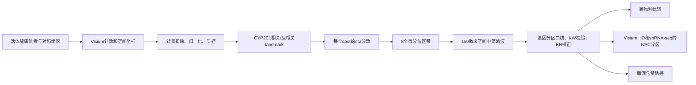

<!-- Generated locally by bin/export_paper_atlas.py. -->
<section class="paper-detail" id="paper-detail">
  <a class="paper-detail__back" href="{{ '/paper-atlas/' | relative_url }}" data-atlas-back>
    <i class="fa-solid fa-arrow-left" aria-hidden="true"></i> Back to Paper Atlas
  </a>
  <header class="paper-detail__hero">
    

      Atlases &amp; Resources
      Nature · 2026
    

    <h1>Human-liver-atlas</h1>
    
A spatial atlas of the healthy human liver from live donors

    
<a class="paper-detail__doi" href="https://doi.org/10.1038/s41586-026-10377-y" target="_blank" rel="noopener noreferrer" aria-label="Open DOI for Human-liver-atlas">Open paper <i class="fa-solid fa-arrow-up-right-from-square" aria-hidden="true"></i></a><a class="paper-detail__code" href="https://github.com/OranYak/Human-liver" target="_blank" rel="noopener noreferrer" aria-label="Open code for Human-liver-atlas">Code <i class="fa-solid fa-arrow-up-right-from-square" aria-hidden="true"></i></a>

  </header>

  

    <button class="is-active" type="button" role="tab" id="paper-detail-tab-zh" aria-selected="true" aria-controls="paper-detail-panel-zh" data-detail-tab="zh">中文方法解读</button>
    <button type="button" role="tab" id="paper-detail-tab-en" aria-selected="false" aria-controls="paper-detail-panel-en" tabindex="-1" data-detail-tab="en">English Summary</button>
  

<article class="paper-detail__panel" id="paper-detail-panel-zh" role="tabpanel" aria-labelledby="paper-detail-tab-zh" tabindex="0" data-detail-panel="zh" lang="zh-CN" markdown="1">

## Human Liver Atlas：如何从活体健康供者重建肝小叶空间分区

### 一句话理解这项工作

这篇论文的关键贡献不只是“多测了几张肝脏切片”，而是先解决健康参照是否真的健康，再建立一条可计算的门管区—中央静脉空间坐标轴。作者从活体健康肝供者获得组织，用 Visium 测量每个空间点的转录本，再依据一组门管区和中央区标志基因把每个点放到 8 个肝小叶区带中；随后用 MERFISH、Visium HD、PhenoCycler 和单核 RNA 测序验证或扩展这个坐标系，并把它用于跨物种比较、非实质细胞分区和早期脂肪变性分析。

它首先是一套健康人肝空间参考图谱，其次才是一组关于人类特异分区和疾病早期变化的生物学发现。

### 1. 为什么“健康组织来源”是方法的一部分

肝小叶由门管区向中央静脉方向接受血流，氧、营养物和信号随位置形成梯度。肝细胞因此把不同任务安排在不同区带，这就是肝脏分区。若参照组织本身受到缺血、药物、肿瘤或炎症影响，重建出的“正常分区”就可能混入取材条件的效应。

以往人肝图谱常使用两类材料：神经系统死亡供者组织，或者肿瘤/病变切除组织旁边看似正常的组织。前者经历机械通气、药物和缺血，后者可能受到局部或全身疾病影响。本文的 8 名活体健康供者在捐肝前经过严格筛查，样本在手术中直接取得；另有 8 份病变邻近正常组织作为对照。

论文的第一步因此不是立即计算分区，而是先做患者级 pseudo-bulk 比较。每位患者所有合格空间点的表达被汇总，随后用层次聚类、PCA 和差异分析比较 LHD 与 adjacent-normal。图 1 显示两组明显分离：邻近正常组织的免疫和应激相关基因较高，而多种经典肝细胞功能基因较低。这个结果说明“组织看起来正常”并不等于转录状态适合作为健康基线。

这个设计也有边界：LHD 数量只有 8，年龄较轻且相对同质；它是更干净的健康参照，但并不覆盖全人群的年龄、族群和生活方式差异。

### 2. 输入、输出和整条计算路线

#### 输入

- 16 份人肝 10X Visium 数据：8 份 LHD，8 份邻近正常组织；
- 其他哺乳动物的 Visium 数据：小鼠、野猪、家猪和牛；
- 3 名 LHD 的 Visium HD、2 名 LHD 的 MERFISH、6 名患者的 PhenoCycler；
- 4 名 LHD 的 snRNA-seq；
- H&E 图像以及人工标注的纤维化、包膜和脂滴区域。

#### 核心输出

- 每个 Visium spot 的连续空间分数 $\eta$；
- 每个 spot 的 1—8 区带标签；
- 每个基因沿中央区到门管区的平均表达曲线；
- 每个基因的分区显著性、曲线质心和 portal bias；
- 跨物种分区差异、非实质细胞分区及配体—受体候选；
- 随局部脂滴含量变化的早期脂肪变性表达轨迹。

### 3. 从原始 spot 到可比较表达值

#### 3.1 背景扣除

Visium 捕获区域中，组织外 spot 也可能记录扩散出来的游离 RNA。代码 `compute_background_counts_for_github.m` 用组织外 spot 的平均计数构造背景向量，从组织内每个 spot 的计数中逐基因扣除，负值截为零。这个步骤试图减少高丰度肝细胞转录本污染附近位置。

#### 3.2 相对归一化与质控

对每个 spot，代码用总计数归一化：

$$
x'_{gs}=\frac{x_{gs}}{\sum_g x_{gs}},
$$

其中 $x_{gs}$ 是基因 $g$ 在 spot $s$ 的背景校正计数。之后根据总 UMI 和线粒体转录本比例去除离群 spot，并排除 Loupe Browser 中人工标注的纤维化、肝包膜或解剖不清区域。

人工排除不是无关紧要的清理步骤：纤维化区域和包膜并不沿正常肝小叶轴变化，若保留会扭曲 landmark 选择和区带边界。代价是该流程依赖人工标注，换一批数据时必须重新审阅。

论文写总 UMI 低于均值 3 个标准差的 spot 被去除，主 QC 脚本也设置 `UMI_ZTHRESH=-3`；底层导入函数另有 `-4` 默认值。最终运行使用哪个入口会影响少量边界 spot，因此这是应保留的实现差异。

### 4. 核心算法：用 landmark genes 构造空间坐标

#### 4.1 为什么选择 CYP2E1

CYP2E1 是经典中央静脉周围肝细胞标志。作者先由病理学家标注门管区，并验证 CYP2E1 在远离门管区的位置稳定升高。随后只在 5 个无脂肪变性的健康 LHD 样本中，计算每个基因与 CYP2E1 的 Spearman 相关。

- 相关性最高的 20 个基因定义为 pericentral landmarks；
- 相关性最低的 20 个基因定义为 periportal landmarks。

只用 M4—M8 选择 landmark 是关键限制条件：若把已有脂肪变性的样本放入训练集，脂滴相关转录变化可能被误当成正常空间轴。

#### 4.2 为什么先按每个基因的最大值缩放

不同 landmark 的绝对表达量可能相差几个数量级。代码先对每个基因跨所有 spot 做最大值归一化：

$$
\tilde{x}_{gs}=\frac{x'_{gs}}{\max_s x'_{gs}}.
$$

这样每个 landmark 在自身动态范围内贡献相近，避免某个高丰度基因单独主导坐标。

#### 4.3 $\eta$ 分数

对 spot $s$，令 $P$ 为门管区 landmark 集合，$C$ 为中央区 landmark 集合：

$$
\eta_s=\frac{\sum_{g\in P}\tilde{x}_{gs}}
{\sum_{g\in P}\tilde{x}_{gs}+\sum_{g\in C}\tilde{x}_{gs}}.
$$

$\eta$ 越大，spot 越像门管区；越小，越像中央区。它不是显微镜直接测量的物理距离，而是由表达相似度定义的“分子位置”。如果病理状态同时改变整套 landmark，$\eta$ 可能偏离真实几何位置，所以作者先在健康样本上建立坐标并进行多模态验证。

公开 MATLAB 脚本 `a3_visium_12_patients_zonation_reconstruction_for_github.m:49-90` 完整实现了健康样本选择、相关性排序、最大值归一化和 $\eta$ 计算，这一核心环节与论文方法是 Exact 对应。

### 5. 从连续分数到 8 个肝小叶区带

`extract_zonation_for_github.m` 在每个样本内计算 $\eta$ 的 0、12.5、25…100 百分位数，把 spot 等量分到 8 个区带。代码约定 zone 1 靠中央，zone 8 靠门管区。

百分位分箱的优点是不同切片即使 $\eta$ 数值范围不同，每一区都有相近 spot 数，便于跨患者平均。缺点是它强制每张切片都覆盖完整且等比例的肝小叶轴；若切片只采到某一局部，区带编号仍会被拉伸成 1—8，不能理解为固定微米距离。

#### 空间中值滤波

初始区带图可能出现孤立的“椒盐噪声”。`median_zone_filter_for_github.m` 找出 150 µm 内邻居，并把每个 spot 的标签替换成邻居标签中位数。若 spot 没有邻居，则保留原标签。

这一步利用了邻近肝细胞通常处于相似微环境的假设。它能抑制技术噪声，但也可能把真实而锐利的局部边界平滑掉，因此不应把滤波后的区带当成单细胞级精确位置。

### 6. 怎样判断一个基因真的分区

对每个基因，代码分别计算 8 个区带的平均表达与标准误，并用 Kruskal–Wallis 检验判断各区带分布是否相同。所有基因的 $p$ 值用 Benjamini–Hochberg 方法校正；论文以 $q<0.25$ 作为发现阈值。

作者还计算表达曲线的质心：

$$
\mathrm{COM}_g=\frac{\sum_{z=1}^{8}z\,\mu_{gz}}
{\sum_{z=1}^{8}\mu_{gz}},
$$

其中 $\mu_{gz}$ 是基因 $g$ 在 zone $z$ 的平均表达。质心较小表示偏中央，较大表示偏门管区。图 2 的大热图正是把 1,724 个肝细胞特异基因按这种空间位置排序；其中 1,141 个达到论文的分区显著性阈值。

$q<0.25$ 是偏宽松的图谱发现标准，不等同于临床验证阈值。它适合系统性描绘候选分区，但单个基因的强结论应结合表达曲线、成像和独立平台证据。

### 7. 多模态验证各自回答什么

#### MERFISH

MERFISH 在两名 LHD 中直接成像约 500 个基因的 RNA 分子并分割细胞。它不依赖 Visium 的 poly(A) 捕获，因此可检验分区曲线是否由 Visium 技术造成。两平台的分区曲线相关达到 $R=0.49$ 和 $0.57$。

#### Visium HD

Visium HD 使用 2×2 µm bins 和探针杂交，在三名 LHD 的 FFPE 切片中提供更高空间分辨率。其分区结果与普通 Visium 相关约 $R=0.7$。公开 Groovy 脚本在 QuPath 中调用 StarDist 分割细胞，扩张 6 µm，并把 HD bins 关联到细胞对象；但模型路径、spot 尺度和数据路径是患者/机器特异的，不能直接跨机器运行。

#### PhenoCycler

PhenoCycler 用 48 种抗体检查部分 RNA 分区是否在蛋白层也成立，例如 PCK2、GLUT2 和若干中小叶标志。它提供正交验证，但覆盖蛋白远少于转录组。

三种验证共同说明主空间轴不是某一种技术的产物，不过它们并未对全部 1,724 个基因逐一验证。

### 8. 跨物种比较：portal bias 的含义

对同源基因，论文用最门管区与最中央区表达的比值概括方向：

$$
\mathrm{PortalBias}_g=\log_2\frac{E_{g,\mathrm{PP}}}{E_{g,\mathrm{PC}}}.
$$

正值表示门管区偏向，负值表示中央区偏向。图 3 将人和小鼠的 portal bias 逐基因对照，相关只有 $R=0.15$；进一步加入野猪、家猪和牛，显示 WNT/Notch 等部分程序保守，但 PCK2、SLC2A2、HNF4A 和部分尿素循环、脂质代谢基因在人类更偏中央。

这不意味着这些基因只在人类表达，而是它们沿肝小叶轴的相对位置不同。跨物种结论还会受到同源基因映射、取材和物种样本数影响。仓库包含核心人类分区代码，但完整跨物种同源映射表生成过程并未作为端到端脚本发布，因此属于 Partial 对应。

### 9. 非实质细胞分区：从 HD 到单核数据

普通 Visium spot 混合多个细胞，不适合直接定位肝窦内皮细胞、Kupffer 细胞、成纤维细胞等 NPC。作者先在 Visium HD 图像中用 StarDist 分割细胞，再根据空间 bins 的表达给细胞分类；对每种细胞类型分别选择中央/门管 landmark。随后把这些细胞类型特异 landmark 应用于 4 名 LHD 的 snRNA-seq，为每个细胞核计算类似的 $\eta$ 并分配区带。

这个桥接策略的逻辑是：HD 提供位置但覆盖有限，snRNA-seq 提供大量细胞和更丰富转录本；共同的 landmark 把二者连接到同一空间轴。图 4 展示 67,000 多个细胞核的类型图、不同细胞类型的分区热图，以及沿空间轴共变的配体—受体候选。

配体—受体分析依据双方分区曲线的相关性，例如中央区 LSEC 的 WNT2 与肝细胞 FZD5。空间共变提高了相互作用的合理性，但没有测量实际配体结合或信号流，仍是候选机制而非直接因果证据。

### 10. 早期脂肪变性：把组织图像变成连续暴露量

作者在 H&E 图像中训练 QuPath 像素分类器，把像素分成脂滴、非脂滴和背景。对每个 Visium spot 计算脂滴面积比例，然后只在中央区 spot 中按脂质含量排序和分箱，观察基因表达如何随局部脂滴积累变化。

图 5 左侧显示脂滴主要位于中央区，右侧的分类图展示 spot/细胞与脂滴区域的叠加。作者发现脂质积累早期，部分脂质摄取或合成基因下降，β 氧化和脂质输出相关基因上升；核编码线粒体蛋白转录本总体下降，而线粒体基因组编码转录本上升，被解释为一种代偿反应。

这里的“轨迹”不是纵向追踪同一个细胞，而是把不同 spot 按脂滴含量从低到高排列得到的伪时间式横截面序列。它能提出动态假说，但不能证明每个细胞必然沿同一路径演变。像素分类器也需要逐张切片人工训练，保存模型未完整纳入公开代码。

### 11. 论文与代码的对应关系

#### Exact

- CYP2E1 相关/反相关各 20 个 landmark 的选择；
- 每个 landmark 的最大值归一化与 $\eta$ 公式；
- 8 个百分位区带分配；
- 150 µm 空间中值滤波；
- Kruskal–Wallis 检验、BH 校正和表达质心；
- 组织外 spot 背景向量扣除；
- QuPath/StarDist 的 HD cell-to-bin 映射框架。

#### Partial

- QC 的 UMI 阈值在主脚本与底层默认值间有 `-3`/`-4` 差异；
- 跨物种同源基因处理没有完整端到端入口；
- snRNA-seq 的 Scanpy/Harmony 预处理主要由方法文字和后续 MATLAB 解析脚本描述；
- 脂滴像素分类依赖未完整发布的逐切片分类器；
- 许多输入路径需要替换，部分参数按患者硬编码。

#### Not found

- GSEA Java 程序的执行脚本；
- 从原始多模态数据到所有论文主图的一键流水线；
- 可直接复用的 QuPath StarDist 模型及所有患者分类器；
- 完整、自动化的跨物种 orthologue 建表流程。

因此代码保真度对“核心分区算法”较高，对整篇论文的端到端复现则是部分覆盖。

### 12. 阅读图谱时应保留的边界

1. **$\eta$ 是表达定义的坐标，不是直接测量距离。** 百分位分箱还会把每张切片拉伸到完整 8 区。
2. **健康基线更干净但样本仍小。** 8 名 LHD 不能代表全部年龄与人群背景。
3. **宽松 FDR 用于发现。** $q<0.25$ 适合图谱筛选，不应脱离曲线和成像证据解读单个基因。
4. **空间相关不证明细胞通信。** 配体和受体沿同一轴共变只是相互作用候选。
5. **脂肪“轨迹”是横截面排序。** 它不能替代真正的纵向或干预实验。

在这些边界内，这项工作最可靠的产物是一套以活体健康供者为基准、由多种空间技术交叉验证的人肝小叶表达坐标系。人类特异代谢分区、NPC 信号轴和早期脂肪变性程序，是建立在该坐标系上的优先验证假说。

</article>
<article class="paper-detail__panel" id="paper-detail-panel-en" role="tabpanel" aria-labelledby="paper-detail-tab-en" tabindex="0" data-detail-panel="en" lang="en" markdown="1" hidden>

## summary.md — Human Liver Atlas

### Paper Information

| Field | Value |
|---|---|
| **Title** | A spatial atlas of the healthy human liver from live donors |
| **Authors** | Oran Yakubovsky, Keren Bahar Halpern, Shalev Itzkovitz et al. |
| **Journal** | Nature |
| **Year** | 2026 |
| **DOI** | 10.1038/s41586-026-10377-y |
| **Web app** | https://shalevapps.weizmann.ac.il/liver_app/ |
| **Code** | https://github.com/OranYak/Human-liver (MATLAB R2022a) |
| **Data (Spatial Transcriptomics)** | Zenodo: https://zenodo.org/records/17735506 |
| **Data (PhenoCycler)** | Zenodo: https://zenodo.org/records/17735558 |
| **Data (MATLAB datasets for code)** | Zenodo: https://zenodo.org/records/17735587 |

---

### Motivation & Novelty

#### Biological Problem

The liver is organized into hexagonal lobules with a porto-central axis that drives **liver zonation** — the spatial segregation of metabolic functions across the lobule radius. Understanding zonation is critical for liver disease biology: steatosis, hepatitis, fibrosis, and drug toxicity all exhibit zone-specific patterns.

#### The Healthy Reference Problem

Most existing human liver atlases use one of two sources:
- **Neurologically deceased donors (NDDs)**: affected by mechanical ventilation, medications, and post-mortem ischaemia, which alters gene expression and explains up to 40% of RNA-seq variability (GTEx, Science 2015).
- **Adjacent normal tissue** from liver pathology resections: affected by systemic disease, immune activation, and local tumor signals.

Recent notable atlases include:
- **Guilliams et al.** (Cell, 2022): Spatial proteogenomics of hepatic macrophage niches — but used NDDs
- **Matchett et al.** (Nature, 2024): Multimodal decoding of liver regeneration — adjacent normal from resections
- **Watson et al.** (Nature Communications, 2025): Spatial transcriptomics at single-cell resolution — not from live donors

None used biopsies from clinically healthy live donors.

#### Unique Contributions

1. **First spatial transcriptomics atlas from live healthy liver donors (LHDs)**: n=8, rigorously screened, with matched biopsies taken immediately upon abdominal opening before any hepatic manipulation.
2. **Discovery of human-specific pericentral zonation shifts**: Key metabolic functions are periportal in mice/other mammals but pericentral in humans, including gluconeogenesis (PCK2), GLUT2 (SLC2A2), urea cycle enzymes (ASL, NAGS, OTC), and HNF4A.
3. **Cross-species comparative atlas**: New spatial transcriptomics from wild boar (n=2), domestic pig (n=3), and cow (n=2) enabling systematic comparison across 5 mammalian species.
4. **NPC zonation with snRNA-seq + Visium HD integration**: Spatially resolved zonation of LSECs, Kupffer cells, and fibroblasts, with ligand-receptor interaction mapping.
5. **Dynamic steatosis analysis**: Combining ML-based lipid quantification from H&E with spatial transcriptomics reveals compensatory mitochondrial and lipid metabolism changes in early MASLD.

---

### Method Overview

#### Multi-Modal Technology Stack

| Technology | Resolution | Genes | Patients | Purpose |
|---|---|---|---|---|
| 10X Visium | 55 µm spots | ~33,000 | 16 human + 7 non-human | Primary zonation atlas |
| Visium HD | 2×2 µm bins | ~33,000 (probe-based) | 3 LHDs (FFPE) | High-res validation + NPC analysis |
| MERFISH | Single-molecule | 500 genes | 2 LHDs | Single-cell spatial validation |
| PhenoCycler | Subcellular | 48 proteins | 6 patients | Protein-level zonation validation |
| snRNA-seq | Single-nucleus | ~33,000 | 4 LHDs | Cell-type atlas + NPC zonation |

#### Computational Pipeline

1. **Preprocessing**: Background subtraction using outside-tissue spots; relative normalization; UMI/mito QC filtering; manual exclusion of fibrotic and capsule spots.
2. **Zonation score (η)**: Each spot assigned a portal bias score via ratio of PP to total landmark gene expression (max-normalized). Landmark genes = 20 most correlated / 20 most anti-correlated with CYP2E1 across non-steatotic LHDs.
3. **Zone assignment**: 8 equal-percentile zones from η; spatial median filtering at 150 µm.
4. **Statistics**: Kruskal-Wallis test + Benjamini-Hochberg FDR (q < 0.25 threshold).
5. **Cross-species**: Log₂(periportal/pericentral) expression ratios; rank-sum testing of portal bias distributions.
6. **NPC zonation**: Visium HD StarDist segmentation → cell-type classification → landmark gene extraction → snRNA-seq nucleus zone inference.
7. **Steatosis trajectory**: QuPath pixel classifier for lipid quantification → gene expression binned by lipid content → k-means clustering.

All primary analysis code is in MATLAB R2022a. Groovy (QuPath) for Visium HD cell segmentation. Python (Scanpy/Harmony) for snRNA-seq analysis.

#### Key Biological Assumptions

- CYP2E1 expression is a reliable pericentral reference gene (validated by pathologist; consistent with published mouse and human data)
- The 20-gene landmark sets capture the porto-central axis without capturing disease-related variation
- Spots predominantly composed of hepatocytes can be identified by hepatocyte-specific gene expression (Massalha et al. 2020 atlas as reference)

---

### Evaluation

#### Datasets

| Dataset | Size | Type | Purpose |
|---|---|---|---|
| Human Visium (LHD) | 8 patients, 49,092 spots → 44,243 retained | 10X Visium (fresh-frozen) | Primary analysis |
| Human Visium (adjacent normal) | 8 patients | 10X Visium | Comparison, disease context |
| Visium HD | 3 patients (M1, M2, M6), FFPE | Probe-based, 2µm bins | Single-cell resolution validation |
| MERFISH | 2 patients (M5, M8), 500 genes | In situ hybridization | Method validation |
| snRNA-seq | 4 patients (M5-M8), >67,000 nuclei | GEM-X Flex, FFPE | NPC atlas |
| Non-human Visium | Mouse n=6, boar n=2, pig n=3, cow n=2 | 10X Visium | Cross-species comparison |

#### Key Results

**LHD vs. adjacent normal** (Fig. 1c-e):
- Clear separation in pseudo-bulk clustering; LHD liver has higher expression of canonical hepatocyte functions (CYP2E1, CYP2C8, ASS1, PCK2) and lower immune gene expression (S100A8, S100A9, CRP)
- NDD livers show additional hypoxia (LDHA, GAPDH) and stress (IFITM2, IFITM3) signatures
- Linear mixed regression confirms sample type (LHD vs. adjacent normal) is the dominant driver of variability (greater than age, sex, or histology)

**Zonation** (Fig. 2):
- 1,141/1,724 hepatocyte genes significantly zonated (q < 0.25) — widespread zonation
- MERFISH vs. Visium correlation: R = 0.49 (M5) and R = 0.57 (M8)
- Visium HD vs. Visium correlation: R = 0.7

**Cross-species** (Fig. 3):
- Human vs. mouse portal bias correlation: R = 0.15 — unexpectedly weak
- Human hepatocytes are significantly more pericentrally biased than ALL other 4 species tested (one-tailed rank-sum P < 1.45×10⁻⁶ for each)
- Pericentrally enriched in humans but not mice: PCK2, HNF4A, GLUT2, ASL, OTC, NAGS, FASN, APOA5, lipogenic enzymes
- WNT pathway zonation conserved across all species (pericentral WNT/RSPO, periportal Notch)

**NPC zonation** (Fig. 4):
- 67,000+ nuclei, 4 LHD livers; major cell types identified
- LVECs, T cells, VSMCs, cDC2, B cells, cholangiocytes: periportal
- Fibroblasts, hepatocytes, Kupffer cells, LSECs: all zones
- Pericentral fibroblast BMP9/BMP10 (GDF2) → hepatocyte/LSEC ACVRL1/ENG signaling axis identified
- Pericentral WNT2 from LSECs → FZD5 on hepatocytes

**Steatosis** (Fig. 5):
- Lipid accumulation pericentral in all 4 steatotic patients
- As lipid increases: decrease in DGAT1, SLC27A3, NPC1L1 (lipid influx/synthesis); increase in DIO1, HSD17B4 (beta-oxidation), ABCB4 (lipid secretion)
- Global decrease in nuclear-encoded mitochondrial proteins (NDUFA9, NDUFS4, NDUFS8)
- Compensatory increase in mitochondria-encoded transcripts (MT-ND1, MT-ND4L)
- Correlation with Visium HD large vs. small lipid droplets: R = 0.21 (P = 3.33×10⁻³)
- Steatosis gene expression poorly correlated with mouse CDAA-HFD model (except severe steatosis patient P17)

---

### Reproducibility

**Rating: 3/5**

#### Strengths
- Full spatial transcriptomics raw data deposited on Zenodo (preprocessed count tables, images, Loupe files)
- All main analysis code on GitHub (MATLAB)
- Supplementary tables with zonation profiles, DE genes, and interaction scores
- Interactive web app for data exploration (https://shalevapps.weizmann.ac.il/liver_app/)
- snRNA-seq + Visium HD data also on Zenodo

#### Limitations
- **MATLAB only** (R2022a): requires proprietary software (~$500/year license) — significant barrier compared to Python-based tools
- **Zenodo token in README**: the data download link uses an authentication token that may expire; the published paper version uses a different token (https://zenodo.org/records/17735506 vs. 14795740 in README)
- **Manual annotation steps**: fibrotic, capsule, and lipid zones annotated in Loupe browser and stored as CSV files; these annotations are not fully documented or version-controlled
- **Non-human mammalian samples**: obtained from slaughterhouses / hunting expeditions; processing conditions not as tightly controlled as LHD biopsies
- **QuPath lipid classifier**: trained per-slide with manual annotations; not transferable without retraining
- **GSEA not scripted**: requires external GSEA Java application; not in repository
- **Windows-specific paths**: code has `addpath('X:\oran\...')` for private server paths — these must be replaced on any other system

#### Practical Notes for Reproduction
1. Install MATLAB R2022a + Bioinformatics Toolbox + Statistics Toolbox
2. Download Zenodo data (use the DOI link https://zenodo.org/records/17735506, not the README token link)
3. Replace all `addpath('X:\...')` lines with local paths
4. Run scripts in order: a1 → a2 → a3 (10–12 min per patient set)
5. For Visium HD: install QuPath + StarDist extension + configure `pathModel` and CSV paths
6. For snRNA-seq: requires Python (Scanpy 1.10.0, Harmonypy 0.0.10) environment

</article>
</section>

